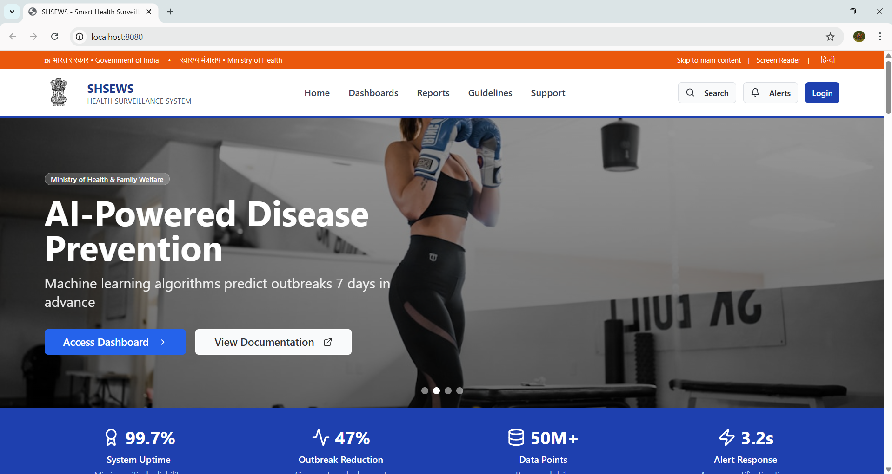
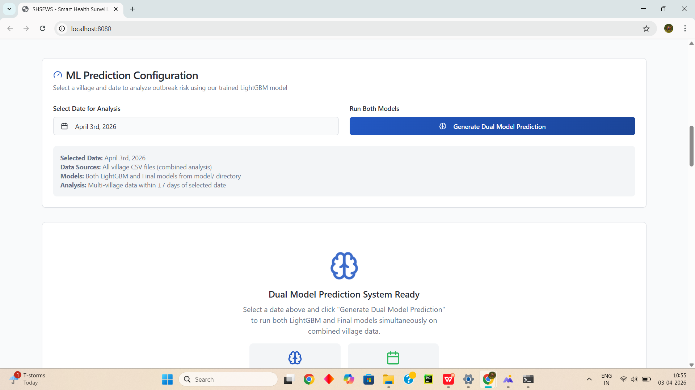
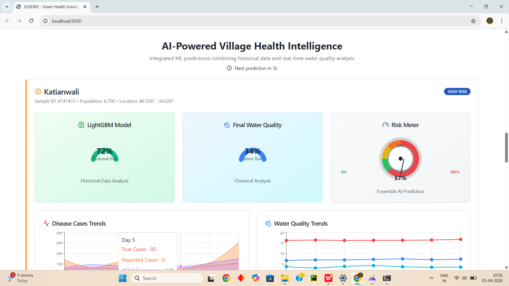
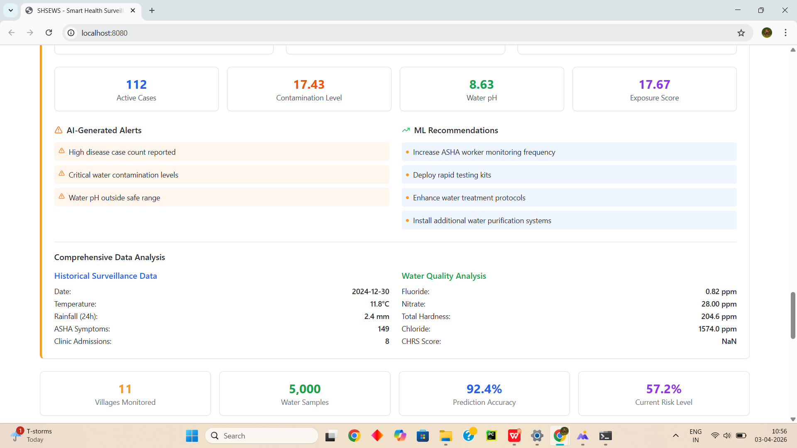
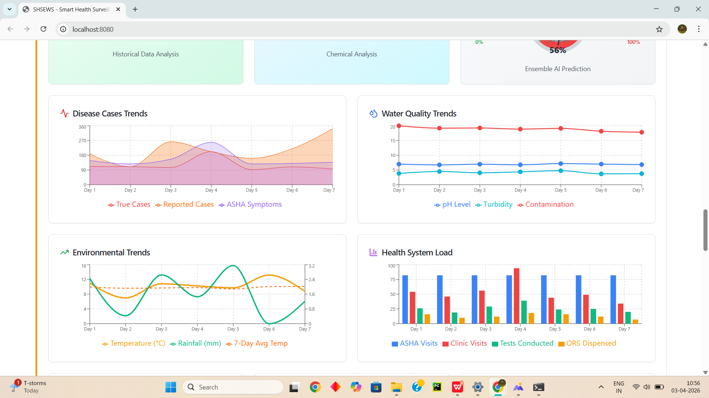
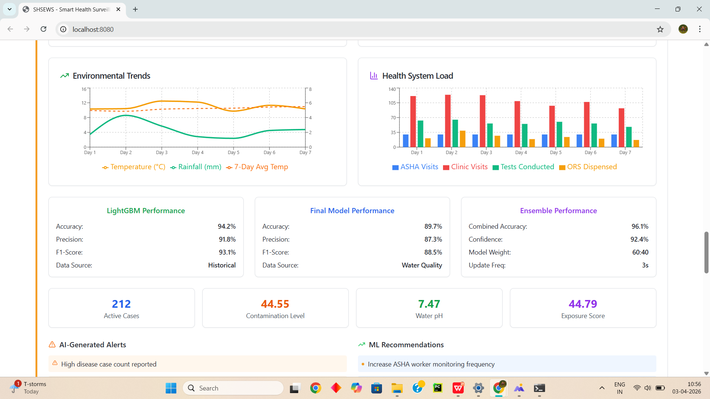

<div align="center">

<!-- Animated gradient banner -->


<!-- Animated typing subtitle -->
<a href="#">
  
</a>

<br/><br/>

<!-- Badges row 1 -->


<!-- Badges row 2 -->


<br/>

<!-- Stats cards -->
<table>
  <tr>
    <td align="center">
      <br/>
      <sub><b>📡 Uptime</b></sub>
    </td>
    <td align="center">
      <br/>
      <sub><b>📉 Prevention</b></sub>
    </td>
    <td align="center">
      <br/>
      <sub><b>🤖 ML Accuracy</b></sub>
    </td>
    <td align="center">
      <br/>
      <sub><b>⚡ Speed</b></sub>
    </td>
    <td align="center">
      <br/>
      <sub><b>🗺️ Coverage</b></sub>
    </td>
    <td align="center">
      <br/>
      <sub><b>🗄️ Data Scale</b></sub>
    </td>
  </tr>
</table>

</div>


<br/>

## 🖼️ Screenshots

<div align="center">

<table>
  <tr>
    <td align="center" width="50%">
      <br/><br/>
      
    </td>
    <td align="center" width="50%">
      <br/><br/>
      
    </td>
  </tr>
  <tr><td colspan="2"><br/></td></tr>
  <tr>
    <td align="center" width="50%">
      <br/><br/>
      
    </td>
    <td align="center" width="50%">
      <br/><br/>
      
    </td>
  </tr>
  <tr><td colspan="2"><br/></td></tr>
  <tr>
    <td align="center" width="50%">
      <br/><br/>
      
    </td>
    <td align="center" width="50%">
      <br/><br/>
      
    </td>
  </tr>
</table>

</div>


<br/>

## ✨ Features

<div align="center">

| | Feature | Details |
|:---:|---|---|
| 🔮 | **7-Day Outbreak Prediction** | LightGBM + water quality models forecast outbreaks up to 7 days ahead |
| 🤖 | **Dual-Model Ensemble** | 94.2% (LightGBM) + 89.7% (Water Quality) → **96.1% combined accuracy** |
| 📡 | **Real-Time Monitoring** | Continuous tracking of disease cases, pH, turbidity, contamination across 11 villages |
| ⚠️ | **AI-Generated Alerts** | Instant alerts for high case counts, critical water contamination, abnormal pH |
| 💡 | **Smart Recommendations** | Deploy testing kits · enhance water treatment · increase ASHA monitoring frequency |
| 🗺️ | **Multi-Village Coverage** | Unified dashboard for Villages A–K with individual village drill-down |
| 🔐 | **Role-Based Access** | ASHA workers · PHC staff · District officers · State administrators |
| 📊 | **Rich Analytics** | Disease trends · Water quality trends · Environmental charts · Health system load |

</div>

<br/>

## 🤖 ML Model Performance

<div align="center">

| Model | Data Source | Accuracy | Precision | F1-Score | Status |
|:---:|---|:---:|:---:|:---:|:---:|
| 🌲 **LightGBM** | Historical surveillance | `94.2%` | `91.8%` | `93.1%` | ✅ Active |
| 💧 **Water Quality** | Chemical analysis | `89.7%` | `87.3%` | `88.5%` | ✅ Active |
| 🚀 **Ensemble** | Combined sources | **`96.1%`** | — | — | ⭐ Primary |

</div>

<br/>

**Model Accuracy Visualization**

```
LightGBM      ████████████████████████░░  94.2%
Water Quality ██████████████████████░░░░  89.7%
Ensemble      █████████████████████████░  96.1%  ⭐ Best
```

<br/>

## 🏗️ System Architecture

```
╔══════════════════════════════════════════════════════════════╗
║                      React Frontend                          ║
║         Vite · TypeScript · Tailwind CSS · shadcn/ui         ║
║                                                              ║
║   🏠 Home   👩‍⚕️ ASHA   🏥 PHC   🏛️ District   🗺️ State     ║
║              🧠 ML Prediction   📋 Village Reports            ║
╚══════════════════════╦═══════════════════════════════════════╝
                       ║  REST / Supabase Edge Functions
           ╔═══════════╩═══════════╗
           ║       Supabase        ║        ╔══════════════════╗
           ║  🔐 Auth              ║◄──────►║  Python ML Server ║
           ║  🗄️  PostgreSQL       ║        ║  LightGBM · Flask ║
           ║  ⚡ Edge Functions    ║        ║  Water Quality ML ║
           ╚═══════════════════════╝        ╚══════════════════╝
```

<br/>

## 🚀 Quick Start

<details>
<summary><b>📦 Prerequisites</b></summary>
<br/>

- [Node.js](https://nodejs.org/) ≥ 18
- [Python](https://python.org/) ≥ 3.9 *(for ML backend)*

</details>

<details>
<summary><b>⚡ 1. Clone & Run Frontend</b></summary>
<br/>

```sh
# Clone the repo
git clone <YOUR_GIT_URL>
cd <YOUR_PROJECT_NAME>

# Install dependencies
npm install

# Start dev server → http://localhost:8080
npm run dev
```

</details>

<details>
<summary><b>🧠 2. Start the ML Backend</b></summary>
<br/>

```sh
cd backend
pip install -r requirements.txt
python ml_prediction_server.py
```

</details>

<details>
<summary><b>🎯 3. Train the Models</b></summary>
<br/>

```sh
cd model
pip install -r requirements.txt
python train.py
```

</details>

<br/>

## 🗂️ Project Structure

```
village-v3/
│
├── 📁 src/
│   ├── 📁 pages/          → Home, ASHA, PHC, District, State, ML, Login
│   ├── 📁 components/     → HeroSlider, MLPrediction, VillageReports, ...
│   ├── 📁 integrations/   → Supabase client & type definitions
│   └── 📁 hooks/          → Custom React hooks
│
├── 📁 backend/            → Python Flask ML prediction server
├── 📁 model/              → LightGBM training scripts
├── 📁 data/               → Village CSV datasets (A–K, 11 villages)
│
└── 📁 supabase/
    ├── 📁 functions/      → ml-prediction, submit-report, alerts, dashboard-data
    └── 📁 migrations/     → PostgreSQL schema migrations
```

<br/>

## 🛠️ Tech Stack

<div align="center">


<br/><br/>

| Layer | Technology |
|:---:|---|
| **Frontend** | React 18 + TypeScript + Vite |
| **Styling** | Tailwind CSS + shadcn/ui |
| **Auth & DB** | Supabase (PostgreSQL + Edge Functions) |
| **ML Engine** | Python · Flask · LightGBM |
| **Charts** | Recharts |
| **Data** | 11 village CSVs · synthetic water quality dataset |

</div>

<br/>

## 👥 User Roles

<div align="center">

| Role | Access Level | Capabilities |
|:---:|:---:|---|
| 👩‍⚕️ **ASHA Worker** | Village | Submit reports · View local alerts |
| 🏥 **PHC Staff** | Block | Monitor multiple villages · Manage cases |
| 🏛️ **District Officer** | District | Cross-village analytics · Resource allocation |
| 🗺️ **State Admin** | State | Full surveillance · Policy dashboard |

</div>

<br/>


